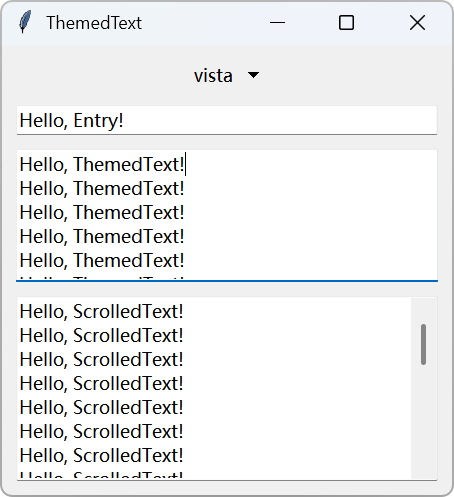
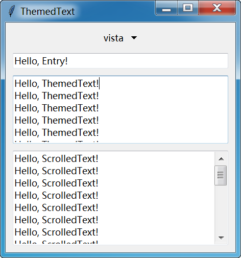

# TtkText

[简体中文](./README_zh.md) |
**English** |
<small>More translations are welcome!</small>

[](./CODE_OF_CONDUCT.md)
[](./LICENSE)
[](https://github.com/Jesse205/TtkText/actions/workflows/testing.yml)

[](https://pypi.org/project/ttk-text/)

Themed Tkinter Text widget with modern styling support.

## Features

- 🎨 Theme-aware text widget that automatically adapts to ttk themes
- 📜 Built-in ScrolledText component with vertical/horizontal scrollbars
- 🖥️ Native integration with ttk styles and themes
- 🔄 Dynamic theme switching support

## Installation

```bash
pip install ttk-text
```

## Quick Start

```python
from tkinter import Tk
from ttk_text import ThemedText
from ttk_text.scrolled_text import ScrolledText

root = Tk()
themed_text = ThemedText(root)
themed_text.pack(fill="both", expand=True)

scrolled_text = ScrolledText(root)
scrolled_text.pack(fill="both", expand=True)

root.mainloop()
```

## Usage

### Styling Configuration

The ThemedText component works by wrapping a Text widget inside a ttk Frame. This Frame uses the default style name `ThemedText.TEntry`, which you can use to customize its appearance.

| Property         | Description                                                            |
| ---------------- | ---------------------------------------------------------------------- |
| borderwidth      | Frame border width                                                     |
| focuswidth       | Focus border width, used only for Frame padding calculation in TtkText |
| fieldbackground  | Text background color                                                  |
| foreground       | Text font color                                                        |
| padding          | Text external padding                                                  |
| insertwidth      | Text cursor width                                                      |
| selectbackground | Text selection background color                                        |
| selectforeground | Text selection font color                                              |

Example: Set border width to `1.5p`.

```python
from tkinter.ttk import Style

style = Style()
style.configure("ThemedText.TEntry", borderwidth="1.5p")
```

### Theme Fixes

Some third-party themes may not be fully compatible with TtkText. You can call the following function after setting the theme:

<details>
<summary>Sun Valley ttk theme</summary>

```python
from tkinter.ttk import Style
import sv_ttk


def fix_sv_ttk(style: Style):
    if sv_ttk.get_theme() == "light":
        style.configure("ThemedText.TEntry", fieldbackground="#fdfdfd", borderwidth=5)
        style.map(
            "ThemedText.TEntry",
            fieldbackground=[
                ("hover", "!focus", "#f9f9f9"),
            ],
            foreground=[
                ("pressed", style.lookup("TEntry", "foreground")),
            ]
        )
    else:
        style.configure("ThemedText.TEntry", fieldbackground="#292929", borderwidth=5)
        style.map(
            "ThemedText.TEntry",
            fieldbackground=[
                ("hover", "!focus", "#2f2f2f"),
                ("focus", "#1c1c1c"),
            ],
            foreground=[
                ("pressed", style.lookup("TEntry", "foreground")),
            ]
        )

sv_ttk.set_theme("light")
fix_sv_ttk(Style())
```

</details>

## Screenshots

<div>



</div>

Example screenshots of Windows 11, Windows 10, and Windows 7.

## Contributing

See [CONTRIBUTING.md](https://github.com/Jesse205/TtkText/blob/main/CONTRIBUTING.md) for details.

## License

This project is licensed under the MIT License, see the [LICENSE](./LICENSE) file for details.
