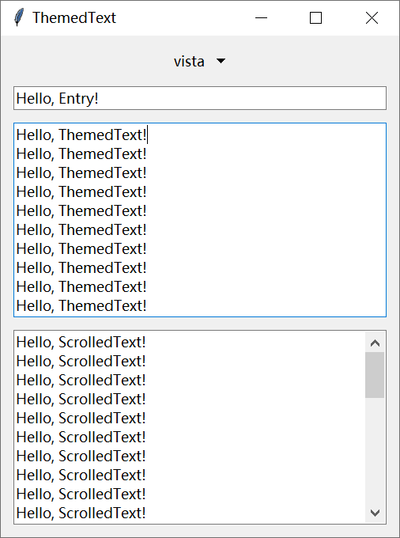

# TtkText

**简体中文** |
[English](./README.md) |
<small>期待您的翻译！</small>

[](./CODE_OF_CONDUCT_zh.md)
[](./LICENSE)
[](https://github.com/Jesse205/TtkText/actions/workflows/testing.yml)

支持现代主题样式的 Tkinter Text 组件。

## 特性

- 🎨 支持主题感知的文本组件，可自动适配 ttk 主题
- 📜 内置 ScrolledText 组件，支持垂直/水平滚动条
- 🖥️ 原生集成 ttk 样式和主题
- 🔄 支持动态主题切换

## 安装

```bash
pip install ttk-text
```

## 快速开始

```python
from tkinter import Tk
from ttk_text import ThemedText
from ttk_text.scrolled_text import ScrolledText

root = Tk()
themed_text = ThemedText(root)
themed_text.pack(fill="both", expand=True)

scrolled_text = ScrolledText(root)
scrolled_text.pack(fill="both", expand=True)

root.mainloop()
```


## 屏幕截图

<div>



</div>

Windows 11、Windows 10 和 Windows 7 的示例截图。

## 参与贡献

详情请参阅 [CONTRIBUTING.md](./CONTRIBUTING.md)。

## 许可证

本项目使用 MIT 许可证，查看 [LICENSE](./LICENSE) 了解更多信息。
